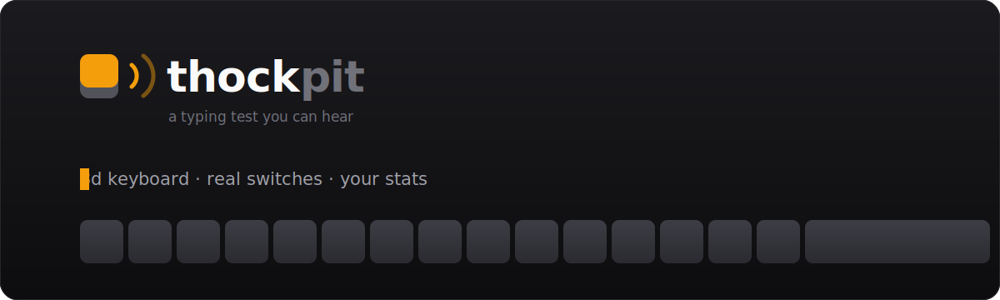
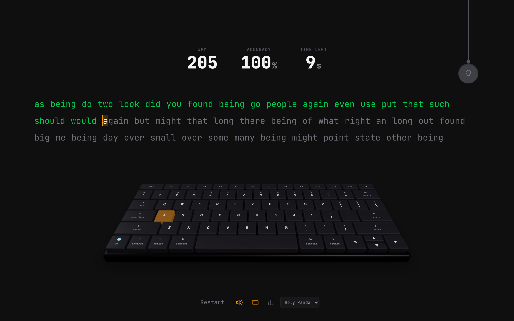
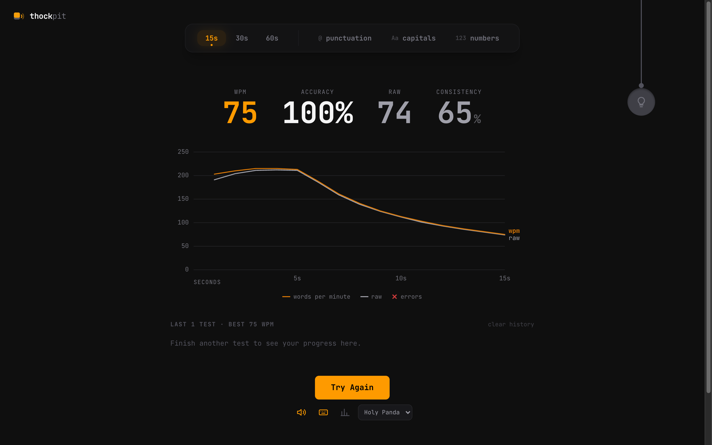
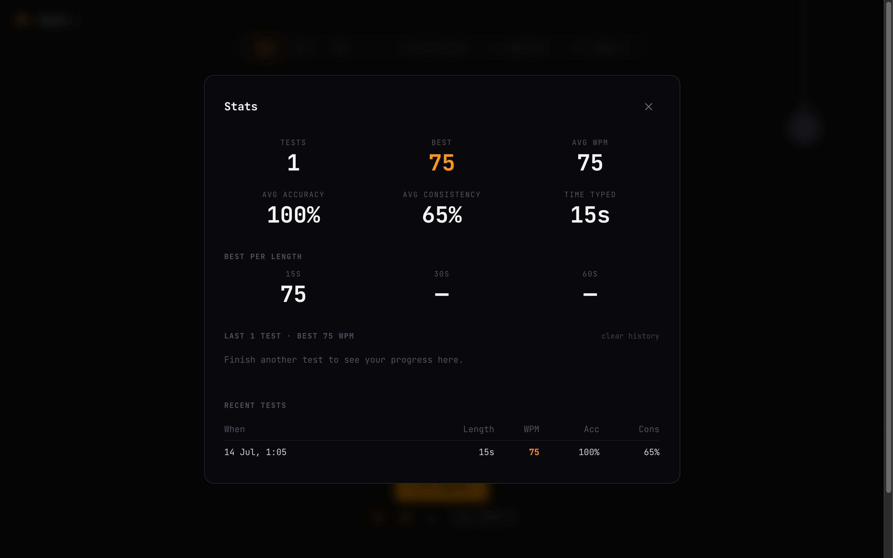

<p align="center">
  
</p>

<p align="center">
  
  
  
  
</p>

**Thockpit** is a typing test you can *hear*. A 3D mechanical keyboard sits under the
words and reacts as you type — the right keycap sinks, the next one glows, and every
stroke plays a recording of a real switch. When the clock runs out you get a graph of
what actually happened, and every run is kept locally so you can watch yourself improve.

```bash
npm install
npm run dev     # → http://localhost:3000
```

No accounts, no backend, no telemetry. Everything lives in your browser.

<p align="center">
  
</p>

<p align="center">
  
  
</p>

---

## Contents

- [Features](#features)
- [How it works](#how-it-works)
- [Sound packs](#sound-packs)
- [Project structure](#project-structure)
- [Design decisions](#design-decisions)
- [Accessibility](#accessibility)
- [Scripts](#scripts)
- [Deploying](DEPLOYMENT.md)
- [Credits](#credits)

---

## Features

### ⌨️ A real 3D keyboard

A MacBook (US ANSI) layout rendered in WebGL with three.js — actual keycap geometry,
lights, shadows, and a deck that tilts as you move the cursor. Not a CSS approximation:
the caps genuinely sit above the deck plane, so they parallax correctly and cast
shadows onto it.

The layout is the real thing, down to the key widths — `delete` is 1.5u, `caps lock`
1.75u, both shifts 2.25u, the arrows are a proper inverted-T, and `F` and `J` have
home-row bumps. Every row adds up to 14.5u, which is what keeps the deck rectangular.

- The key you must press **next** pulses amber.
- A capital letter also lights the **opposite** shift key — the one you're supposed
  to use.
- On a phone, where the keyboard reports no key codes at all, the key is worked out
  from the character that lands in the input — so the board still plays along.
- The whole board can be hidden from the toolbar if you'd rather just type.

### 🎯 …and it shows you what you keep missing

When the test ends, the board comes back as a **heatmap**: every key you typed is
coloured by how often you actually hit it. Green is clean, amber is slipping, red is
trouble. Keys you never touched stay grey.

Every other typing test hands you a graph. None of them can show you that your `;`
is the problem.

### 🔊 Real switch sounds

Recordings of actual switches, not synthesis. Twelve packs ship, and each one carries:

- a **different press sample per keyboard row**, so the board sounds uneven the way a
  real one does,
- **dedicated samples** for the stabilised keys (space, enter, backspace),
- an **up-stroke** sample, because releasing a key makes a sound too.

Every press is detuned a few percent at random, so two strokes of the same key are
never identical. Samples decode up-front and play through a compressor, so fast typing
doesn't clip or lag.

### 🏆 A best worth celebrating

Beat your own record and the board says so: a wave rolls out from the middle of the
keyboard, every cap lifting and flashing amber as it passes, over a rising arpeggio
that could never be mistaken for a keystroke.

Then hit **Share** and the run renders to an image — your wpm, the shape of the run,
the mistakes, a personal-best badge if you earned one. It goes to the share sheet on
a phone, the clipboard on a desktop, and your downloads folder if the browser allows
neither.

### ⏪ Replay

Press **Replay** and the board types your test back to you: the same keys, at the same
moments, with the same sounds — including every mistake and every backspace. Kept in
memory only, since a minute of fast typing is a thousand keystrokes and fifty of those
would not fit in `localStorage`.

### 💡 A light you pull

The lamp hanging in the corner is a pull-chain. Grab it, **pull it down**, and let go —
the cord stretches, springs back, and the light comes on (light theme). Pull again and
it goes off. Pull less than the threshold and nothing happens, exactly like the real
thing. It's also a plain button, so a tap or the keyboard works fine.

### 📈 Stats that mean something

After every test:

| | |
|---|---|
| **WPM** | correct characters ÷ 5, per minute |
| **Raw** | every character you typed, mistakes included |
| **Accuracy** | correct keystrokes ÷ total keystrokes |
| **Consistency** | how even your pace was — the coefficient of variation of your per-second raw speed, inverted. Typing at a constant speed scores 100. |

…and a graph of **speed per second**: your wpm line, your raw line, and a red **×**
wherever you slipped. Hover anywhere on it for the numbers at that second.

Every run is saved to `localStorage` (the last 50). The **stats panel** in the toolbar
shows your averages, your best per mode, a graph of your recent runs, and a table of
your last ten.

### ✍️ Words, or a sentence

15, 30 or 60 seconds of common English drawn from ~960 words — and the list tops itself
up as you go, so the clock ends the test, never the word list. Or switch to **quote**
mode and type a real sentence from public-domain literature; it ends when the sentence
does.

Backspace reaches **back into the previous word**, the way it does in a real editor, and
`esc` restarts.

---

## How it works

### The typing engine — `hooks/useTypingEngine.ts`

Holds the words, the per-character state (`idle` / `correct` / `incorrect` / `current`),
the timer, and the stats. Input arrives through a hidden `<input>`, so the browser's own
text handling (backspace, repeat, IME) does the boring work.

While the test runs it takes **one sample per elapsed second** — wpm, raw, and the
number of mistakes made during that second. That array is the result graph. When the
clock ends (or you finish the words), it builds a `TestResult`, saves it, and hands it
back. An untouched test is never saved.

### The board — `components/Keyboard3D.tsx`

The layout table in `utils/keyboard.ts` is turned into world-space positions once, then
rendered with React Three Fiber. Key legends are drawn to a canvas and used as textures,
so no font file has to load and nothing goes fuzzy when the board is scaled.

Pressed keys are damped toward their sunk position each frame rather than snapped, and
the emissive glow is lerped, so at 150 wpm the board still looks like it's being played
rather than strobing.

### The sound — `hooks/useKeySound.ts`

A small Web Audio sample player. The `AudioContext` is created up-front in a suspended
state and all twelve samples for the chosen pack are decoded immediately, so the very
first keystroke already has sound to play — a keydown only has to `resume()` it, which
is the user gesture browsers require.

### The charts — `components/ResultChart.tsx`, `components/HistoryChart.tsx`

Hand-written SVG, no chart library. Scales, ticks, hover crosshair, tooltip, and a
screen-reader table, in about 200 lines each.

---

## Sound packs

| Pack | Feel |
|---|---|
| **Holy Panda** *(default)* | tactile, deep thock |
| **Alpaca**, **Cream**, **Topre** | smooth, poppy, deep |
| **MX Brown**, **MX Black**, **Black Ink**, **Red Ink** | the classics, tactile and linear |
| **Box Navy**, **Blue Alps**, **Turquoise** | loud and clicky |
| **Buckling Spring** | the IBM Model M |

Pick one from the toolbar; the choice is remembered. All 144 samples come from
[**tplai/kbsim**](https://github.com/tplai/kbsim) (MIT) — see
[`public/sounds/CREDITS.md`](public/sounds/CREDITS.md). They add up to about 600 KB.

---

## Project structure

```
app/
  layout.tsx           root layout, fonts, metadata
  page.tsx             the only route
  icon.svg             favicon (Next picks this up automatically)
components/
  TypingTest.tsx       composition root — wires everything together
  WordDisplay.tsx      the words and their per-character colours
  Keyboard3D.tsx       the three.js board
  ThemeToggle.tsx      the pull-chain lamp
  ResultChart.tsx      speed-over-time graph
  HistoryChart.tsx     wpm across recent tests
  StatsPanel.tsx       all-time stats
  Stats.tsx            the live wpm / accuracy / timer row
  ModeSelector.tsx     test length and options
  Logo.tsx             the keycap mark
hooks/
  useTypingEngine.ts   test state, per-second sampling, results
  useKeySound.ts       Web Audio sample player
utils/
  keyboard.ts          MacBook layout table, char → key mapping
  words.ts             word list and generation
  typing.ts            wpm, accuracy, consistency
  stats.ts             all-time aggregates
  storage.ts           localStorage (history + prefs)
public/sounds/         the switch recordings
```

---

## Design decisions

A few things that are less obvious than they look, kept here so nobody re-learns them
the hard way.

**The board is WebGL, but the fit is measured, not derived.** Sizing the camera with
trigonometry looks right until it isn't: the keycaps stand *above* the deck plane, so
they project wider than the deck's own footprint, and the board yaws with the cursor.
Both push the edges out of frame — `fn` and the right arrow get clipped. The camera rig
instead measures the board's real bounding box and binary-searches the closest distance
that still projects all eight corners inside the view. It's correct at any aspect ratio.
(drei's `<Bounds>` fits a bounding *sphere*, which for a board this wide and flat
overshoots the other way and leaves it tiny.)

**The result graph has one y-axis.** Monkeytype-style charts often put errors on a
second scale; two y-scales in one chart is the single most misleading thing you can do
to a reader. Errors ride on the raw line instead — same scale, no second axis.

**Chart colours were validated, not eyeballed.** Amber-500 (the UI accent) fails the
lightness band on a dark surface, so the lines use `#d97706` on dark and `#b45309` on
light — both clear 3:1 contrast against their surface. Both lines are also labelled
directly, so identity never rests on colour alone.

**Pointer capture eats clicks.** The pull-chain first used `setPointerCapture`, which
retargets the follow-up `click` to the capturing element — so a plain tap on the lamp
never reached the button and the theme wouldn't toggle. It tracks the drag on `window`
instead.

**A page-wide click handler will steal your focus.** Clicking anywhere refocuses the
hidden typing input — which snatched focus off the switch dropdown and shut it the
instant it opened. Interactive controls stop the click from propagating; the stats panel
blurs the input while it's up, or keystrokes would quietly run a test behind it.

---

## Accessibility

- Every chart ships a `sr-only` table of the same numbers.
- Series are direct-labelled, so a colourblind reader never has to tell amber from grey.
- The lamp is a real `<button>`: tab to it, hit enter.
- The stats panel is a labelled dialog and closes on `Escape`.
- The banner above honours `prefers-reduced-motion`. **The app itself doesn't yet** —
  the board's tilt and the next-key pulse keep animating. Worth fixing.

---

## Scripts

| Command | What it does |
|---|---|
| `npm run dev` | dev server on :3000 |
| `npm run build` | production build |
| `npm start` | serve the build |
| `npm run lint` | eslint |

Deploying it (Vercel or anywhere else): [`DEPLOYMENT.md`](DEPLOYMENT.md).

---

## Credits

- Switch recordings — [tplai/kbsim](https://github.com/tplai/kbsim) (MIT)
- Type — [JetBrains Mono](https://www.jetbrains.com/lp/mono/)
- Built with [Next.js](https://nextjs.org), [React Three Fiber](https://r3f.docs.pmnd.rs/),
  and [Tailwind](https://tailwindcss.com)
